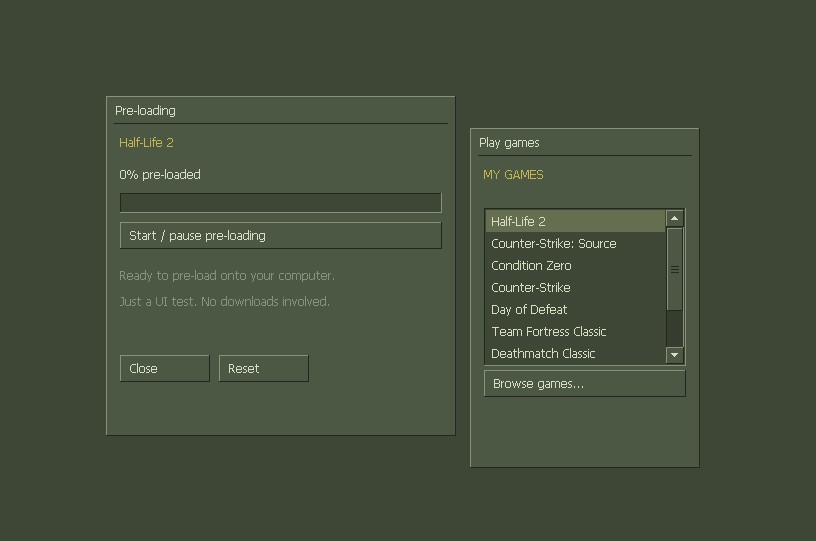

# vgui-framework

[](https://vgui-framework.gitbook.io/docs)
[](https://github.com/insomfaze/vgui-framework/blob/main/TODO.md)
[](https://github.com/insomfaze/vgui-framework/releases)

A small C++17 / DirectX 11 GUI library inspired by the olive interfaces in classic Steam and Counter-Strike 1.6. It has its own renderer, input handling and widgets. No Dear ImGui dependency and no Valve source code.

The classic demo has two separate desktop windows: a game list and a simulated pre-load dialog. `vgui_features.exe` demonstrates UTF-8 editing, clipboard, DPI, scrolling, images, tooltips and overlapping panels.

The features described here are in the source tree. The original v0.1.0 demo predates them; build from source to try them.

## Preview



## Requirements

- Windows 10 or newer, DirectX 11 feature level 11.0 and the D3D11.1 runtime interfaces.
- Visual Studio with **Desktop development with C++**, a Windows SDK and CMake tools.
- CMake 3.20 or newer, a C++17 compiler, and Ninja when using the build script.
- Tahoma is rasterized using Windows GDI.

Hardware rendering is preferred. If device creation fails, the renderer tries WARP.

## Build and run

From the repository root in PowerShell:

```powershell
# Standalone executable with the C++ runtime linked in:
.\build.ps1 -StaticRuntime
.\build\vgui_demo.exe
.\build\ninja\vgui_features.exe

# Build a DLL and an executable that uses it:
.\build.ps1 -Shared
.\build\shared\vgui_demo.exe
```

The script finds Visual Studio, the x64 compiler and a Windows SDK, configures CMake/Ninja, builds Release and runs the tests. `-SkipTests` skips test execution. Close any running copy before rebuilding it.

| Configuration | Output |
| --- | --- |
| Default or `-StaticRuntime` | `build/ninja/vgui-framework.lib`, `build/ninja/vgui_demo.exe` |
| Standalone demo convenience copy | `build/vgui_demo.exe` |
| `-Shared` | `build/shared/vgui-framework.dll`, import library `vgui-framework.lib`, `vgui_demo.exe` |

`-Shared` and `-StaticRuntime` cannot be combined. The DLL and its client use the shared MSVC runtime because the C++ API passes standard-library types across the boundary. The DLL build may need the matching Microsoft Visual C++ runtime installed on another computer.

You can also use CMake directly from a Visual Studio developer shell:

```powershell
cmake -S . -B build/local -DVGUI_STATIC_RUNTIME=ON
cmake --build build/local --config Release
ctest --test-dir build/local -C Release --output-on-failure

cmake -S . -B build/dll -DVGUI_BUILD_SHARED=ON
cmake --build build/dll --config Release
ctest --test-dir build/dll -C Release --output-on-failure
```

Build products belong in `build/` and are ignored by Git. Keep release executables outside the source directory or attach them to a GitHub Release.

## Add it to your application

```cmake
add_subdirectory(path/to/vgui vgui-build)
add_executable(my_app WIN32 main.cpp)
target_link_libraries(my_app PRIVATE vgui::vgui)
```

`vgui::vgui` is an alias for `vgui-framework`. The target supplies the include directory, C++17 requirement, Windows definitions and system libraries.

For a DLL build, set the option before adding the directory:

```cmake
set(VGUI_BUILD_SHARED ON CACHE BOOL "Build VGUI as a DLL")
add_subdirectory(path/to/vgui vgui-build)
target_link_libraries(my_app PRIVATE vgui::vgui)
```

Put `vgui-framework.dll` beside the application executable. With CMake, the required `VGUI_SHARED` definition is propagated automatically. If you link a prebuilt DLL manually, define `VGUI_SHARED`, include `vgui.hpp` and link the DLL's import library. Do not define `VGUI_BUILDING_LIBRARY` in the client.

Use matching architecture, compatible MSVC/STL versions, runtime settings and Debug/Release configuration for the DLL and client. This is a C++ API, not a stable C ABI or a plugin loaded through a custom `LoadLibrary` entry point. Create and destroy contexts from normal application code, not from `DllMain`.

## Frame loop

Create one context per existing HWND and keep your widget values between frames:

```cpp
#include "vgui.hpp"

vgui::Context ui(hwnd);
vgui::Rect panel{20, 20, 400, 260};
bool sound = true;
float volume = 0.65f;

// Each frame, after dispatching Windows messages:
if (ui.begin_frame()) {
    ui.begin_window("Settings", panel);
    ui.checkbox("Sound", sound);
    ui.slider("Volume", volume, 0.0f, 1.0f);
    if (ui.button("Reset")) volume = 0.65f;
    ui.end_window();
    ui.end_frame();
}
```

In WndProc, call `ui.window_message(msg, wp, lp, result)` and return `result` when it returns true. It forwards input and handles borderless sizing and DPI messages. Otherwise continue normal Win32 processing. For multiple windows, store each context pointer in `GWLP_USERDATA`; clear it before destroying the context. The older `message()` method only forwards input.

Call `TranslateMessage` before `DispatchMessageW` so text input receives `WM_CHAR`. If `begin_frame()` returns false, skip UI submission and `end_frame()` for that context. When every window is minimized, the application can wait for messages.

This constructor owns its DirectX device, swap chain and render target. It handles resize, clears its target and presents in `end_frame()`. A context is not thread-safe; use it on its window's UI thread.

## Render into an existing D3D11 application

```cpp
vgui::Context ui(hwnd, device, immediate_context);

// After the host draws its scene, before its Present:
if (ui.begin_frame(target_width, target_height)) { // Physical pixels.
    ui.begin_window("Settings", panel);
    ui.slider("Volume", volume, 0.0f, 1.0f);
    ui.end_window();
    ui.end_frame(render_target_view);
}
```

The library holds references to the supplied device and immediate context, restores the host's pipeline state, and draws into the supplied render target. It does not clear, resize or present the host's swap chain. Input coordinates must correspond to that target. See [external rendering](docs/external-rendering.md) for resize, texture lifetime and device recovery.

## UTF-8 and DPI

Text arguments and TextEntry values use UTF-8, including Cyrillic. Glyphs are rasterized on demand with Windows GDI; font coverage determines which characters can be displayed. TextEntry moves and deletes by Unicode codepoint. Complex-script shaping, grapheme-cluster editing, IME and undo are not implemented.

Enable per-monitor DPI awareness before creating any HWNDs:

```cpp
SetProcessDpiAwarenessContext(DPI_AWARENESS_CONTEXT_PER_MONITOR_AWARE_V2);
```

Coordinates, font sizes, spacing and item bounds use logical pixels at 96 DPI. Automatic scaling follows the window's DPI, including monitor changes. `ui.set_dpi_scale(1.5f)` overrides it; `ui.set_dpi_scale(0)` restores automatic mode. Call between frames. Explicit render-target dimensions remain physical pixels.

## Desktop windows without a background

There are two independent choices:

- `set_borderless(true)` removes the standard Windows caption and frame from the HWND.
- `WindowMode::Native` makes the VGUI frame fill that HWND and moves the actual desktop window when its title bar is dragged.

```cpp
vgui::Context ui(hwnd);
ui.set_borderless(true); // Before showing the window, or between frames.
vgui::Rect bounds{};

if (ui.begin_frame()) {
    ui.begin_window("My app", bounds, vgui::WindowMode::Native);
    ui.text("No extra host background");
    ui.button("test");
    ui.end_window();
    ui.end_frame();
}
```

Use one native root frame per HWND. For two independently movable desktop windows, create two HWNDs and two contexts, as the demo does. This is explicit application-managed multi-window support, not automatic ImGui-style viewport extraction.

`WindowMode::Panel`, the default, keeps the earlier behavior: a movable VGUI panel inside a larger client area. `set_borderless(false)` restores the saved native style and rectangle. It must be called outside a frame.

Run `vgui_demo.exe --framed` to keep the normal Windows borders. In borderless mode, provide an in-UI Close button or another application command; Alt+F4 also works. Edge and corner resizing is enabled by default through `window_message()`. Use `set_resizable(false)` to disable it or `set_resizable(true, 320, 240)` to set a logical minimum size. Custom minimize/maximize buttons are not provided.

## Widgets

Widget data belongs to the caller. A button returns true on activation; controls that edit a value generally return true when that value changes.

| Widget | Call | Behavior |
| --- | --- | --- |
| Frame | `begin_window(title, bounds, mode)` / `end_window()` | Movable panel or native root frame. |
| Panel | `begin_panel(title, bounds)` / `end_panel()` | Nested, clipped container; coordinates are relative to the parent. |
| Label | `text(value)` | Literal UTF-8 text; accepts newlines. |
| Button | `button(label)` | Mouse release inside, or Space/Enter when focused. |
| CheckBox | `checkbox(label, value)` | Toggles a bool. |
| Slider | `slider(label, value, min, max)` | Mouse drag or arrow keys; requires a finite increasing range. |
| ComboBox | `combo_box(label, selected, items)` | Dropdown with single selection. |
| Tabs | `tabs(id, selected, items)` | Selects a page index; the application draws that page. |
| TextEntry | `text_entry(label, value, max_length)` | Single-line UTF-8 editor with selection and clipboard. |
| Scroll panel | `begin_scroll_panel(title, bounds)` / `end_scroll_panel()` | Clipped content with wheel input and an automatic scrollbar. |
| Tooltip | `tooltip(text, delay)` | Shows help for the preceding widget after a hover delay. |
| Image | `image(texture_srv, width, height, uv, tint)` | Draws a Texture2D from the renderer's device. |
| ScrollBar | `scroll_bar(label, position, total, visible, height)` | Updates the first visible row index. |
| Listbox | `list_box(label, selected, items, visible_rows)` | Scrollable single selection. |
| Multibox | `multi_box(label, selected, items, visible_rows)` | Independent selection flags. |
| ProgressBar | `progress_bar(fraction, segments)` | Discrete, whole segments. Defaults to 16. |

ComboBox, Tabs and Listbox use a zero-based `int` index and `std::vector<std::string>`. Empty lists set the index to `-1`. Multibox uses `std::vector<bool>` and resizes it to the item count, preserving existing flags. List contents should have stable ordering between frames.

TextEntry edits `std::string`. It supports mouse-drag selection, Shift+Left/Right/Home/End, Ctrl+A/C/V/X, Backspace and Delete. `max_length` limits new input in UTF-8 bytes without cutting a codepoint; it does not truncate an existing string. Pasted newlines become spaces.

ScrollBar only updates a number. For automatic content scrolling, use `begin_scroll_panel()` and `end_scroll_panel()`. Content height is measured during submission; the scrollbar appears when content exceeds the viewport. Nested scroll panels route the wheel to the deepest hovered panel. Listbox and Multibox also have their own scrolling.

### Progress blocks

```cpp
ui.progress_bar(progress);     // 16 blocks.
ui.progress_bar(progress, 10); // 10 larger blocks.
```

`progress` is clamped to 0..1. Blocks appear whole, with no partial fill or fade. With 16 segments, a new block appears every 6.25%; at 100%, all 16 are visible. A very narrow bar reduces the block count to fit. Non-finite progress is treated as zero.

## Layout and IDs

Widgets normally take a full row. Width is a one-shot setting:

```cpp
ui.set_next_item_width(100);
ui.button("Apply");
ui.same_line(8);
ui.set_next_item_width(100);
ui.button("Reset");
ui.separator();
ui.spacing(12);
```

`same_line()` uses the default item spacing when no explicit gap is supplied. Set a smaller width before the first widget; there is no automatic column distribution or wrapping. Child panels use explicit positions and restore their parent's layout when closed.

Labels are IDs. A hidden suffix separates identical visible labels:

```cpp
ui.checkbox("test##music", music);
ui.checkbox("test##voice", voice);

for (int i = 0; i < 3; ++i) {
    ui.push_id(i);
    if (ui.button("test")) selected = i;
    ui.pop_id();
}
```

Keep IDs stable. Use a persistent object ID instead of an index when collection order changes. Balance all begin/end and push/pop calls in the same frame and scope.

`last_item()` returns bounds, hover, active and focus state for the most recently submitted widget. Read it before submitting another widget. `frame_stats()` reports vertex and draw-call counts for the last completed frame. `set_vsync(false)` disables the context's default VSync.

## Theme

```cpp
ui.theme.scroll_track = {54, 61, 46};
ui.theme.track = {30, 35, 26};
ui.theme.check = {225, 230, 215};
ui.style.padding = 14;
ui.style.item_spacing = 9;
```

Colors use RGBA bytes. ScrollBar and Slider tracks have separate colors. Other theme fields cover panel/background, text/accent, light/shadow edges, hovered and selected items. Change layout metrics before starting a frame. Metrics use logical pixels and scale with DPI.

## Source layout

| File | Purpose |
| --- | --- |
| `include/vgui.hpp` | Public API and DLL import/export declarations. |
| `src/context.cpp` | Frame lifecycle, native window styling and statistics. |
| `src/input.cpp` | Win32 input and mouse capture. |
| `src/layout.cpp` | Frames, panels, native title-bar dragging, layout and IDs. |
| `src/widgets.cpp` | Widgets and popup behavior. |
| `src/text_entry.cpp`, `src/text.*` | Selection, clipboard, UTF-8 decoding and UTF-16 conversion. |
| `src/extras.cpp` | Images and tooltips. |
| `src/render.cpp`, `src/render.hpp` | DirectX 11 renderer, shaders, font atlas and draw buffers. |
| `src/internal.hpp` | Private UI state. |
| `demo/main.cpp` | Two-window desktop demo; also the DLL client example. |
| `demo/features.cpp` | Interactive gallery of the newer features. |
| `examples/settings.*` | A small settings menu built with the public API. |
| `tests/` | Interaction, layout, native-mode and progress checks. |

Text and solid geometry share font atlas pages. Draws are sorted by root-panel z-order and batched by adjacent texture use; menus and tooltips render above panels. Clicking an exposed root brings it to the front. Child panels inherit their root's order and clipping. Pixel icons do not depend on font glyph alignment.

## Tests

The build script runs CTest. Both static and DLL configurations support the same tests:

- Mouse/keyboard interactions for the widgets.
- Layout, IDs, lifecycle checks and the compiled settings example.
- Borderless style restoration, native frame sizing and discrete progress steps.
- Three-frame startup/render tests for borderless and framed demos.
- External target pixels, pipeline-state restoration, host swap-chain resize, texture ownership, UTF-8 clipboard/editing, DPI hit testing, resource recreation, panel z-order, scrolling and tooltip output.
- Startup/render smoke test for the feature gallery.

These checks use real DirectX contexts with hidden windows.

## Current limits

No docking, accessibility bridge, complex-script shaping, IME, undo or general-purpose list virtualization. Child panels are fixed layout containers; independently floating surfaces should be separate root windows or root panels.

Standalone mode attempts to recreate a removed device on the next frame. External mode waits for the host to call `reset_device(new_device, new_context)`. Caller-owned image textures must be recreated for the replacement device. Tests cover explicit recreation and external reconnection; they do not force a driver crash. A DLL does not install hooks or submit UI automatically.

Read the [documentation on GitBook](https://vgui-framework.gitbook.io/docs) for the
API reference, examples, architecture notes and FAQ. Markdown sources are in [docs](docs/README.md).
Public declarations are in [vgui.hpp](include/vgui.hpp).

## License

[MIT](LICENSE).
